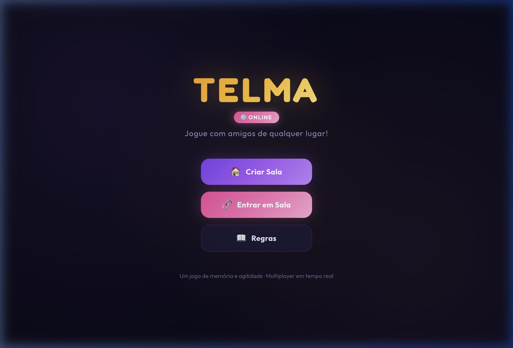
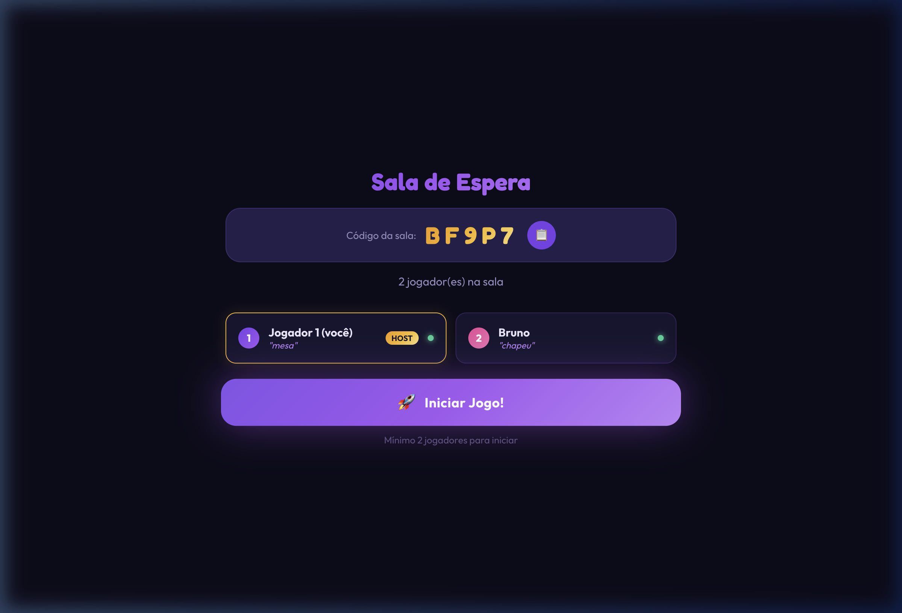
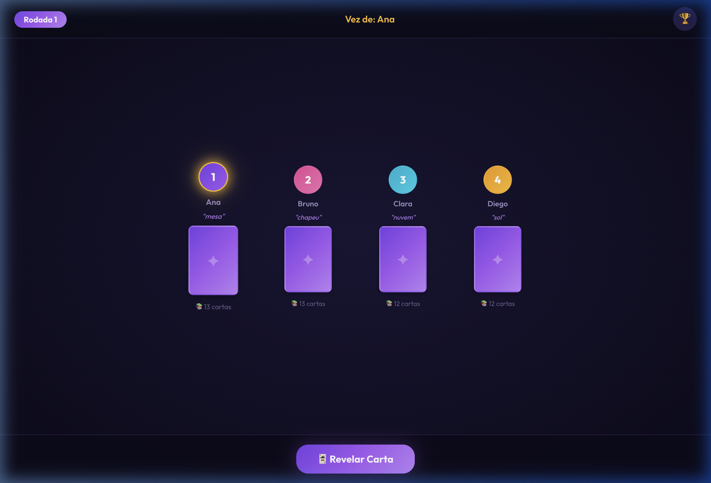

<div align="center">

# 🃏 TELMA

### O clássico jogo de cartas brasileiro — agora online e multiplayer!

[](https://nodejs.org/)
[](https://socket.io/)
[](https://expressjs.com/)
[](LICENSE)

<br/>

> **Crie uma sala, compartilhe o código e jogue Telma com seus amigos de qualquer lugar do mundo!**  
> *Um jogo de memória, agilidade e muita diversão.*

<br/>

[🚀 Jogar Agora](#-como-jogar) · [📖 Regras](#-regras-do-jogo) · [⚡ Deploy](#-deploy-gratuito) · [🛠️ Desenvolvimento](#%EF%B8%8F-rodando-localmente)

<br/>

---

</div>

## ✨ Screenshots

<div align="center">
<table>
  <tr>
    <td align="center"><b>Menu Principal</b></td>
    <td align="center"><b>Sala de Espera</b></td>
  </tr>
  <tr>
    <td></td>
    <td></td>
  </tr>
  <tr>
    <td align="center"><b>Mesa de Jogo</b></td>
    <td align="center"><b>Contenda!</b></td>
  </tr>
  <tr>
    <td></td>
    <td></td>
  </tr>
</table>
</div>

## 🎮 O que é Telma?

**Telma** é um jogo de cartas clássico brasileiro onde os jogadores precisam se livrar de todas as suas cartas. A cada rodada, quando dois jogadores revelam cartas com o mesmo símbolo, acontece uma **contenda** — e o mais rápido a digitar o apelido do oponente vence!

### 🔥 Funcionalidades

<table>
  <tr>
    <td>🌐</td>
    <td><b>Multiplayer Online</b></td>
    <td>Jogue com 2 a 8 amigos em tempo real via WebSockets</td>
  </tr>
  <tr>
    <td>🏠</td>
    <td><b>Sistema de Salas</b></td>
    <td>Crie uma sala e compartilhe o código de 5 dígitos</td>
  </tr>
  <tr>
    <td>⚔️</td>
    <td><b>Contendas</b></td>
    <td>Duelos de digitação quando cartas iguais aparecem</td>
  </tr>
  <tr>
    <td>🌪️</td>
    <td><b>Cartas Especiais</b></td>
    <td>"1, 2, 3!" e "Telma/Surto!" mudam o rumo do jogo</td>
  </tr>
  <tr>
    <td>🏆</td>
    <td><b>3 Rodadas</b></td>
    <td>Apelidos ficam cada vez mais difíceis a cada rodada</td>
  </tr>
  <tr>
    <td>🔄</td>
    <td><b>Reconexão</b></td>
    <td>Caiu a internet? Volte automaticamente à partida</td>
  </tr>
  <tr>
    <td>🛡️</td>
    <td><b>Anti-trapaça</b></td>
    <td>Lógica 100% no servidor — impossível trapacear</td>
  </tr>
  <tr>
    <td>📱</td>
    <td><b>Responsivo</b></td>
    <td>Funciona em celular, tablet e desktop</td>
  </tr>
</table>

## 📖 Regras do Jogo

### Preparação
- Cada jogador escolhe um **apelido** (substantivo comum: "mesa", "chapéu", "fantasma")
- **Memorize os apelidos de todos** — você vai precisar!
- As 50 cartas (12 símbolos × 4 cópias + 2 especiais) são distribuídas

### Jogando
1. Na sua vez, **revele a carta** do topo do seu monte
2. Se o símbolo da sua carta for **igual** ao de outro jogador → **CONTENDA!**
3. Na contenda, ambos devem **digitar o apelido do oponente** o mais rápido possível
4. O **primeiro a acertar** vence — o perdedor recolhe todas as cartas da mesa

### Cartas Especiais

| Carta | Efeito |
|-------|--------|
| 🔢 **1, 2, 3!** | Todos os jogadores revelam uma carta ao mesmo tempo |
| 🌪️ **Telma!** | SURTO! Todos entram em contenda — vale qualquer apelido |

### Sistema de Rodadas

| Rodada | Apelido | Exemplo |
|--------|---------|---------|
| 1ª | Substantivo | `"mesa"` |
| 2ª | + Adjetivo | `"mesa azul"` |
| 3ª | + Ação | `"mesa azul que dança"` |

### Vitória
- Vence a rodada quem **se livrar de todas as cartas primeiro**
- Vence o jogo quem ganhar **mais rodadas** (melhor de 3)

## ⚡ Deploy Gratuito

### Render.com ⭐ (Recomendado)

1. Faça fork ou clone este repositório
2. Acesse [render.com](https://render.com) e crie uma conta
3. **"New +" → "Web Service"** → Conecte o repositório
4. Configure:

```
Build Command:  npm install
Start Command:  node server.js
Instance Type:  Free
```

5. Clique **"Create Web Service"** — pronto em ~2 minutos!

### Outras opções gratuitas

| Plataforma | WebSocket | Sleep | Como |
|-----------|-----------|-------|------|
| [Render](https://render.com) | ✅ | 15min inativo | Deploy via GitHub |
| [Glitch](https://glitch.com) | ✅ | 5min inativo | Import do GitHub |
| [Railway](https://railway.app) | ✅ | Não dorme | Deploy via GitHub ($5 créditos grátis/mês) |

> **Nota:** O frontend e o backend rodam no **mesmo servidor** — não precisa de Netlify/Vercel separado!

## 🛠️ Rodando Localmente

### Pré-requisitos

- [Node.js](https://nodejs.org/) 18 ou superior

### Instalação

```bash
# Clone o repositório
git clone https://github.com/seu-usuario/telma-online.git
cd telma-online

# Instale as dependências
npm install

# Inicie o servidor
node server.js
```

O jogo estará disponível em: **http://localhost:3000**

### Testes em rede local

Para jogar com outras pessoas na mesma rede Wi-Fi:

```bash
# Descubra seu IP (macOS)
ipconfig getifaddr en0

# Outros dispositivos acessam:
# http://SEU-IP:3000
```

## 📁 Estrutura do Projeto

```
telma-online/
│
├── server.js              # 🖥️ Servidor (Express + Socket.IO)
├── package.json           # 📦 Dependências
│
├── public/                # 🌐 Frontend (servido pelo Express)
│   ├── index.html         #    Estrutura HTML
│   ├── style.css          #    Design premium (glassmorphism + dark mode)
│   └── client.js          #    Cliente Socket.IO
│
├── index.html             # 🎮 Versão offline (jogo local)
├── style.css              #    CSS da versão local
├── game.js                #    Engine da versão local
│
└── docs/                  # 📸 Screenshots para o README
    ├── menu.png
    ├── lobby.png
    ├── game.png
    └── contenda.png
```

## 🏗️ Arquitetura

```
┌──────────────┐     WebSocket      ┌──────────────────┐
│  Jogador 1   │◄──────────────────►│                  │
│  (Browser)   │                    │   Node.js Server │
├──────────────┤     WebSocket      │                  │
│  Jogador 2   │◄──────────────────►│  • Express       │
│  (Browser)   │                    │  • Socket.IO     │
├──────────────┤     WebSocket      │  • Game Engine   │
│  Jogador N   │◄──────────────────►│                  │
│  (Browser)   │                    └──────────────────┘
└──────────────┘
                                    Toda a lógica do jogo
                                    roda no servidor!
```

## 🎨 Design

- **Dark mode** com paleta violeta/magenta
- **Glassmorphism** nos painéis e modais
- **Animações 3D** de flip nas cartas
- **Timer visual** durante as contendas
- **Confetti** nas vitórias
- Tipografia moderna (**Outfit** + **Fredoka**)
- 100% **responsivo** (mobile first)

## 🤝 Contribuindo

Contribuições são bem-vindas! Sinta-se à vontade para:

1. Fazer um **fork** do projeto
2. Criar uma **branch** para sua feature (`git checkout -b feature/nova-feature`)
3. **Commit** suas mudanças (`git commit -m 'Adiciona nova feature'`)
4. **Push** para a branch (`git push origin feature/nova-feature`)
5. Abrir um **Pull Request**

### Ideias para contribuir

- [ ] 🔊 Efeitos sonoros
- [ ] 💬 Chat entre jogadores
- [ ] 🤖 Jogadores bot (IA)
- [ ] 🌍 Versão em inglês
- [ ] 📊 Ranking global

## 📄 Licença

Este projeto está sob a licença MIT. Veja o arquivo [LICENSE](LICENSE) para mais detalhes.

---

<div align="center">

**Feito com ❤️ e muitas contendas**

⭐ Se gostou, deixe uma estrela no repositório!

</div>
